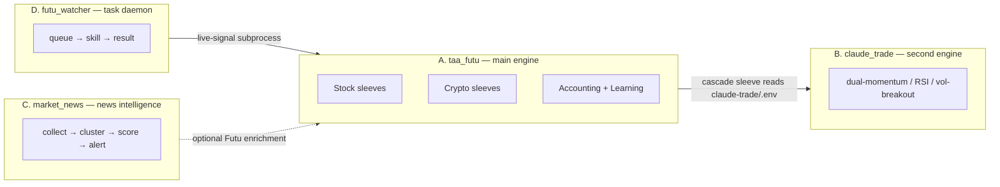
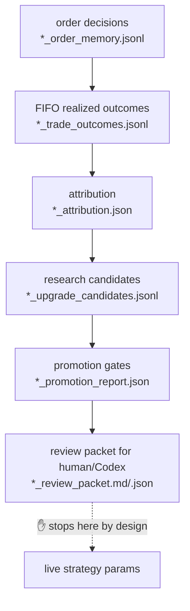

# Architecture

> A map of the whole system, in English, for readers (and future-you) who need to
> understand how the pieces fit. A Chinese deep-dive lives in
> [`docs/系统全貌报告.md`](docs/系统全貌报告.md).

## 1. What this is

A personal **quantitative trading workbench** for Futu (stocks) and Binance
(crypto), built around reproducible, paper-tradable strategies and an
auditable accounting + learning backbone. It is intentionally conservative:
**simulation is the default**, real-money trading is locked behind multiple
explicit switches.

It is **not** a single script. It is four cooperating components:



The single most important thing to understand: **there are two trading engines
in one folder.** `taa_futu` (the mature one, in `src/`) is the main system.
`claude_trade` (nested in `claude-trade/`, its own package) is an earlier,
independent multi-strategy bot. `taa_futu`'s **Cascade sleeve** bridges into it
through `claude-trade/.env`. They are separate codebases on purpose; the bridge
is the only coupling.

## 2. Component A — `taa_futu` (main engine)

A `src/`-layout Python package (`pip install -e .`), ~42 modules, exposing the
`taa-futu` and `taa-futu-panel` CLIs.

### 2.1 Stock strategies (sleeves)

Four sleeves are scored independently, then combined by `strategy_stack.py`
into one account-level target portfolio (weights from `STACK_*_WEIGHT`).

| Module | Sleeve | Core idea |
| --- | --- | --- |
| `strategy.py` | **TAA Baseline** | Reproduces Meb Faber's *A Quantitative Approach to Tactical Asset Allocation*: hold an asset when its month-end price is above the 10-month SMA, else cash; equal-weight the qualifying assets. Default proxies: `US.SPY / EFA / IEF / VNQ / DBC`. |
| `fusion_intraday.py` | **Fusion Intraday** | A synthesized event-driven intraday strategy: SPY regime filter + opening-range breakout + 5-min momentum + VWAP deviation + order-book / tick imbalance, with spread and position constraints. |
| `ofim_intraday.py` | **OFIM Intraday** | Order-Flow-Imbalance strategy, L2-heavy, ranks a universe by layered book imbalance. Also doubles as an intraday **screener** (top-N). |
| `cascade_sleeve.py` | **Cascade** | Bridge sleeve that routes signals from engine B (`claude_trade`). |

> Source verified: `strategy.py` (clean, correct Faber reproduction). The other
> three sleeves are summarized from their design docs in `stock/docs/`; their
> scoring internals were not line-by-line audited for this document.

### 2.2 Crypto strategies (Binance, independent of stocks)

| Module | Purpose |
| --- | --- |
| `crypto_ofim.py`, `crypto_ofim_app.py` | Binance **spot** OFIM engine (paper / testnet) + one-page app |
| `crypto_ofim_stream.py`, `crypto_ofim_watchdog.py` | WebSocket market-data stream + watchdog |
| `crypto_perp.py` | Binance **USD-M perpetual** long/short sleeve |
| `crypto_backtest.py`, `crypto_research_loop.py` | Research replay + parameter search with a locked test set |
| `crypto_learning.py` | Crypto evidence-to-review learning loop |

### 2.3 Execution & operations

- `futu_gateway.py` — Futu OpenD order gateway: limit orders, bid/ask price
  buffer, API retry, read-only health check.
- `auto_trader.py` — the live loop (default New York 09:45–15:55, 60s cycle)
  with **pre-trade hard risk controls**: target gross exposure, per-symbol
  weight, per-order notional, per-cycle turnover, and an **epoch-loss brake**
  that blocks new-risk orders once a loss limit is hit.
- `watchdog.py` — supervises OpenD connectivity and the trader process; restarts
  on disconnect / stall / error.
- `market_data.py` — `yfinance` daily bars + Futu snapshots / minute bars /
  order book / ticks.

### 2.4 Accounting & audit backbone (the most "production-grade" part)

- **Event sourcing**: `runtime/stock_fills.jsonl` is an append-only fill log;
  state is rebuilt from it.
- **Double-entry ledger** (`stock_ledger.py`): every fill becomes balanced
  postings in `runtime/stock_journal.jsonl`, each row carrying a previous-hash +
  event-hash → a **tamper-evident hash chain**.
- **Broker reconciliation**: projected ledger positions are reconciled against
  Futu positions.
- **Doctor** (`stock_doctor.py`): `taa-futu stock-system-doctor` is a read-only
  self-check that reports whether runtime state, split accounting, learning
  packets, trader and watchdog are mutually consistent.

### 2.5 The learning lab → see §4.

### 2.6 Entry points

- `cli.py` (~2,187 lines, ~50 subcommands): `backtest`, `signals`,
  `paper-trade`, `fusion-intraday`, `ofim-intraday`, `live-signal`, `crypto-*`,
  `stock-*`, `dashboard`, …
- `dashboard_app.py` (Streamlit), `control_panel.py` / `unified_panel.py`
  (Tkinter).

## 3. Components B / C / D

**B. `claude_trade`** (`claude-trade/`) — a self-contained second engine with its
own strategies (`dual_momentum`, `rsi_mean_reversion`, `volatility_breakout`,
`cascade`), exchange adapters (`futu_ex`, `crypto_ex`), and risk manager. Used
only via A's Cascade sleeve.

**C. `market_news`** (`../news collector/`) — a standalone news-intelligence
pipeline (domain / application / infrastructure / services layering). Collects
from ~15 CN/HK/US sources, deduplicates, clusters events (Jaccard), scores
impact, ranks instruments, and pushes phone alerts via OpenClaw. Runs as five
launchd lines (collect / notify / health / news-learning / review-api) and has
its **own** evidence-to-review learning loop. **Zero hard coupling** to the
trading engine (optional Futu data enrichment only).

**D. `futu_watcher`** (`../futu_watcher/` + `../futu_queue/` + `../futu_output/`)
— a launchd daemon (`com.jiao.futu-watcher`) that polls `*.task.json` files,
dispatches to Futu skills (snapshot / account / option / intraday /
`live_signal`), and writes `*.result.json`. `live_signal_proxy.py` bridges a
queued task to the `taa-futu live-signal` subprocess.

## 4. The learning loop (and where it stops on purpose)

All three subsystems (stock / crypto / news) implement the same
**evidence → review** loop:



The loop records decisions, labels realized P&L (FIFO), attributes it by
strategy / symbol / reason, proposes small reversible **research candidates**
(e.g. *raise min order value 500 → 750*), runs promotion gates, and emits a
SHA-256-stamped review packet. By design it **never writes back to live
parameters** — `live_auto_promotion = false` is always true, and the code
"cannot edit strategy code". This is a deliberate anti-overfitting safeguard,
not a missing feature.

**Verified state (line counts):** stock side has real data (4,778 order-memory
rows, 940 realized outcomes, 5 candidates) last built 2026-05-15; crypto side
has order memory (18,620 rows) but **0 realized outcomes** (no trades yet), so
its candidates are blocked on insufficient sample.

**The gap to close (human-in-the-loop):** `config.py::load_settings()` reads only
`.env`; nothing reads the candidates / promotion report back into settings. The
planned bridge is a **manual-approval override layer** — an approved candidate is
written to `promoted_overrides.json` (with timestamp, rationale, source
candidate id), and strategies apply that layer on load. Live promotion stays
manual. See [`docs/learning_to_strategy_bridge.md`](docs/learning_to_strategy_bridge.md)
once added.

## 5. Safety model

- Default `FUTU_TRD_ENV=SIMULATE`. Real trading requires
  `FUTU_ENABLE_REAL_TRADING=true` **and** a configured
  `FUTU_UNLOCK_TRADE_PASSWORD_MD5`; real **auto** trading additionally requires
  `FUTU_ALLOW_AUTO_REAL=true`.
- Pre-trade caps + epoch-loss brake (§2.3).
- Config is a frozen dataclass validated at load time (weights summing > 1.0
  raise immediately).
- Secrets live only in `.env`, which is git-ignored (never committed).

## 6. Repository layout

```
trade/
├── src/taa_futu/        # A — main engine (package)
├── tests/               # unit tests (372 passing as of the 2026-05-27 snapshot)
├── docs/                # design docs, learning labs, this overview
├── stock/               # stock screeners, launchers, .app bundles  (currently untracked)
├── crypto/              # crypto data tools                         (currently untracked)
├── claude-trade/        # B — second engine (nested package)
├── runtime/             # event logs, ledgers, learning artifacts   (git-ignored, ~75 GB local)
├── Futu_OpenD_*/        # third-party broker gateway binary         (git-ignored)
├── pyproject.toml       # uv / pip project, entry points
└── uv.lock
```

## 7. Testing

```bash
uv venv --python 3.11 .venv
uv pip install -p .venv/bin/python -e .[dev]
.venv/bin/pytest tests/ -q
```

The suite is fast (~4s) and offline (mocked broker / data), which is why it can
run in CI. As of the latest snapshot it reports 372 passing.

---

*Disclaimer: educational / research software. Not investment advice. Nothing
here should be run against real money without independent review.*
