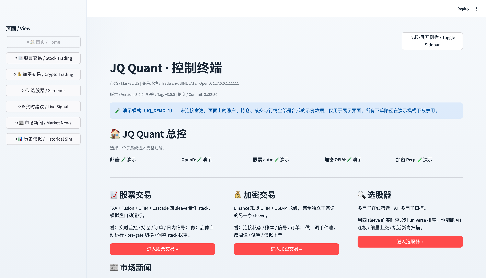
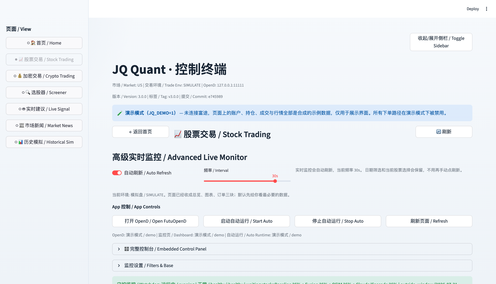
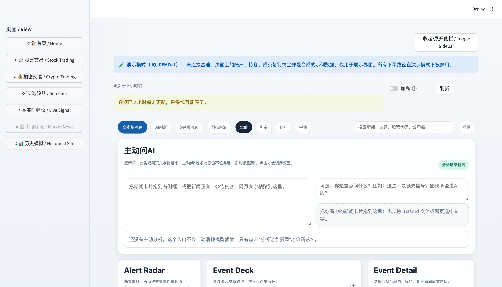
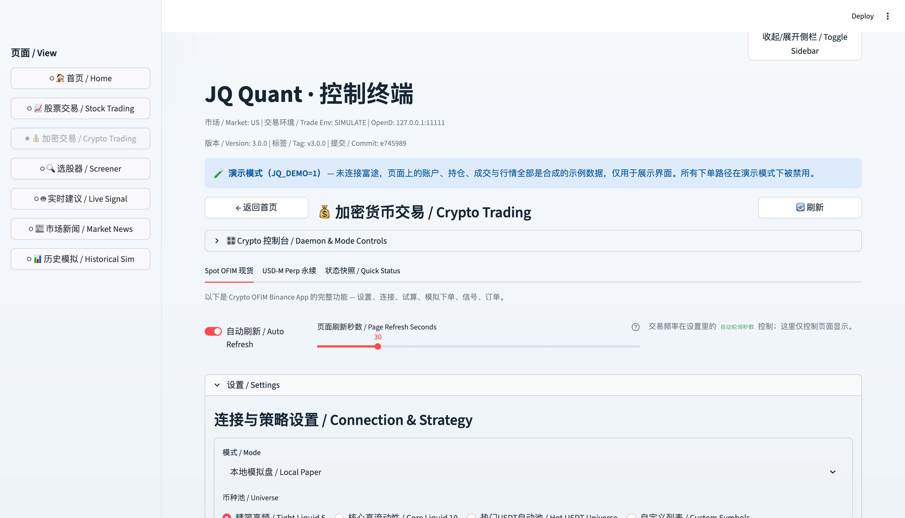
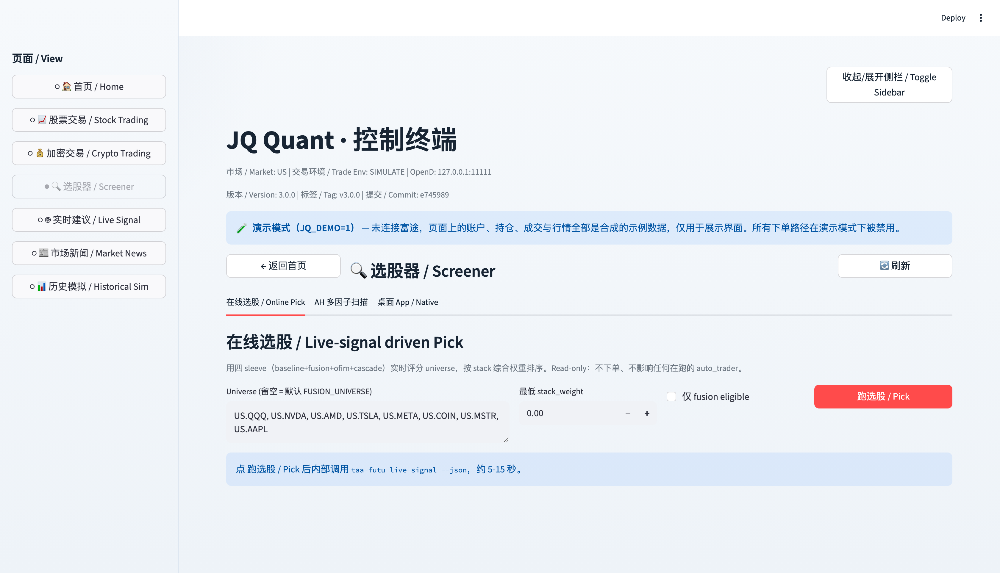
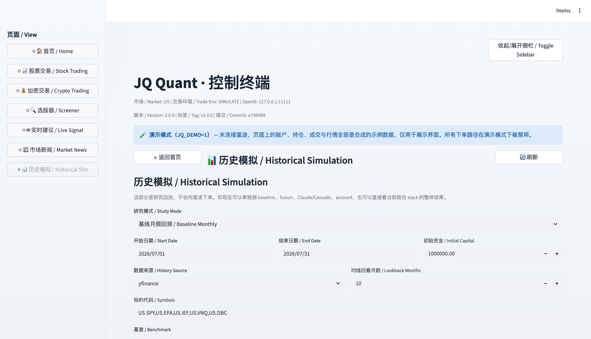
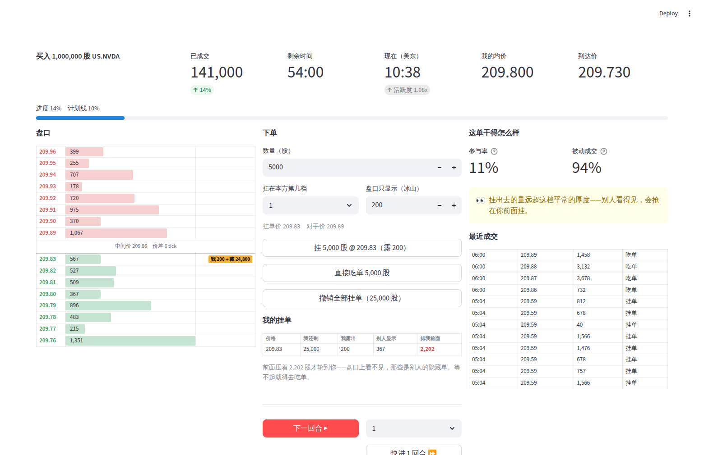

# JQ Quant

一个自建的量化交易工作台：策略回测、实时监控、模拟盘自动下单、新闻事件驱动，
装在一个桌面 app 里。

**不用装富途、不用有账号，也能把整个界面点一遍**——见[演示模式](#演示模式)。



---

## 目录

- [这是什么](#这是什么)
- [演示模式](#演示模式)
- [七个页面](#七个页面)
- [真实运行](#真实运行)
- [策略构成](#策略构成)
- [常用命令](#常用命令)
- [代码结构](#代码结构)
- [插件架构：加一个功能](#插件架构加一个功能)
- [安全边界](#安全边界)
- [测试](#测试)
- [常见问题](#常见问题)

---

## 这是什么

三件事合在一起：

**策略**——四条独立的股票策略并行跑在同一个账户上，各占一部分资金，互不干扰。
一条复现 Meb Faber 的战术资产配置论文（月线择时），三条是日内的事件驱动。
加密那边另有一套完全独立的 Binance 现货与永续策略。

**执行**——信号算出来之后过风控与下单前置闸门，再走富途 OpenAPI 提交到模拟盘。
每一笔记进复式账本，可与券商回报对账。

**新闻**——独立的采集器抓公开信源，聚类成事件，打分排序，够格的推到手机。
看板嵌进 app 的「市场新闻」页。

界面是 Streamlit 写的网页，用 Chrome 的应用窗口模式打开——没有地址栏和标签栏，
Dock 里是独立图标。

---

## 演示模式

**没有富途账号、没有行情数据，也能完整看一遍界面。**

**macOS / Linux**

```bash
git clone https://github.com/jiaojingqi9-sudo/jq-quant.git
cd jq-quant/trade

python3 -m venv .venv                      # Python 要 3.11 / 3.12 / 3.13
.venv/bin/pip install -e .

JQ_DEMO=1 JQ_NEWS_ROOT="$PWD/demo_data/news" \
  .venv/bin/python -m streamlit run src/taa_futu/dashboard_app.py
```

**Windows（命令提示符 cmd）**

三处和上面不一样：可执行文件在 `.venv\Scripts\` 而不是 `.venv/bin/`；
环境变量不能写在命令前面，要先 `set`；`set` 那行等号两边不能有空格。

```bat
git clone https://github.com/jiaojingqi9-sudo/jq-quant.git
cd jq-quant\trade

python -m venv .venv
.venv\Scripts\pip install -e .

set JQ_DEMO=1
set JQ_NEWS_ROOT=%CD%\demo_data\news
.venv\Scripts\python -m streamlit run src\taa_futu\dashboard_app.py
```

**Windows（PowerShell）**——前三步同上，最后三行换成：

```powershell
$env:JQ_DEMO = "1"
$env:JQ_NEWS_ROOT = "$PWD\demo_data\news"
.venv\Scripts\python -m streamlit run src\taa_futu\dashboard_app.py
```

浏览器打开 <http://localhost:8501>。

| | 真实模式 | 演示模式 |
| --- | --- | --- |
| 富途 OpenD | 必须连接 | 不连接，用合成数据 |
| 账户与持仓 | 真实模拟盘 | 五只公开 ETF 的示例持仓 |
| 行情 | 实时推送 | 固定种子生成，每次一样 |
| 新闻 | 采集器实时产出 | `demo_data/news/` 里的虚构事件 |
| 下单 | 可提交 | **全部路径被禁用**，调用直接抛异常 |

每一页顶部都有演示模式横幅，防止截图流出去被误认成真实交易记录。

**Python 版本必须是 3.11 / 3.12 / 3.13**，两头都卡：

- 低于 3.11：代码用了 `datetime.UTC`，import 阶段就报 `cannot import name 'UTC'`
- 3.14 及以上：`pyproject.toml` 写的是 `requires-python = ">=3.11,<3.14"`，
  `pip install -e .` 会直接被拒

Windows 上从 <https://www.python.org/downloads/> 装，安装第一页勾上
**Add python.exe to PATH**。命令行里敲 `python` 跳出微软商店，说明还没装或没进
PATH——商店那个版本装不上本项目的依赖。

直接落到某一页，用 `?view=` 参数：

| 页面 | 链接 |
| --- | --- |
| 股票交易 | `http://localhost:8501/?view=stock` |
| 加密交易 | `http://localhost:8501/?view=crypto` |
| 选股器 | `http://localhost:8501/?view=screener` |
| 实时建议 | `http://localhost:8501/?view=live_signal` |
| 市场新闻 | `http://localhost:8501/?view=news` |
| 历史模拟 | `http://localhost:8501/?view=stock_history` |
| 下单练习 | `http://localhost:8501/?view=exec_trainer` |

也可以只跑单个功能，不带导航：

```bash
JQ_DEMO=1 JQ_FEATURE=news \
  .venv/bin/python -m streamlit run src/taa_futu/standalone.py
```

---

## 七个页面

### 股票交易



四条策略各自的目标仓位、合并后的实际下单计划、实时持仓与委托、当日成交与盈亏、
复式账本对账结果。可以在这里启停自动运行、切换下单前置闸门的三档模式、调整各条
策略的资金占比。

### 市场新闻



新闻采集器产出的交互看板整个嵌进来。事件按重要性、热度、置信度打分排序，映射到
A 股 / 港股 / 美股的候选标的。可以拖一段文字直接问 AI，也可以点开原文。

之所以嵌 HTML 而不是用 Streamlit 重画：拖拽选中、卡片联动、点击跳转都依赖浏览器
DOM，Streamlit 做不了。

### 加密交易



Binance 现货 OFIM 与 USD-M 永续，和股票完全独立的另一条线。连接状态、账本、信号、
委托，以及试算与模拟下单。

### 选股器



用四条策略的实时评分对候选池排序，也能跑 AH 连板 / 缩量上涨 / 接近新高扫描。

### 历史模拟



八种回放模式：月频基线回测、策略组合回测、日内 LOB 实盘回放、精确执行复盘、真实
账户复盘等。基线回测走 yfinance，不需要富途。

### 实时建议

只读地查一次四条策略当前给出的建议，不下单。

### 下单练习



给你一个大单任务（比如「一小时内买 100 万股 NVDA」），自己决定怎么切、什么时候
挂单什么时候吃单，收工打分。市场是合成的，但价差分布、前 20 档深度、成交量、
日内曲线、波动率聚集这几项都拿自己收集的真实盘口标定过。

和前面几个页面不一样，这个页面**不解决赚钱问题，解决「同一个决策，执行得好不好
差多少」的问题**。策略给出信号之后，一笔大单是一次性砸出去还是分两小时慢慢做，
成本能差几十个基点——那部分钱不在策略里，在执行里。

打分基准是「同一个种子、同一段时间、但你没进场的那个市场」。行情涨跌两边一模一样，
减完剩下的纯粹是你留下的脚印——冲击成本和信息泄露藏不住。

不连富途、不要行情权限，永远可用。细节见
[`src/taa_futu/exec_trainer/README.md`](src/taa_futu/exec_trainer/README.md)。

---

## 真实运行

**1. 富途 OpenD** —— 富途的本地网关，负责行情与交易。
从[富途开放平台](https://openapi.futunn.com/)下载，启动后开启 OpenAPI，
默认监听 `127.0.0.1:11111`。

**2. 配置文件**

```bash
cp .env.example .env
```

`.env` 里是策略参数（标的池、回看周期、各种阈值）与富途连接信息。
这个文件在 `.gitignore` 里，不会进仓库。

**3. 起 app**

```bash
.venv/bin/python -m streamlit run src/taa_futu/dashboard_app.py
```

macOS 上也可以用桌面上的启动器——它会检查网关、起服务、用 Chrome 应用窗口打开，
已经在跑就直接复用不重复启动。

**4. 后台任务（可选）**

自动运行、看门狗、新闻采集与推送都是 launchd 常驻任务。安装脚本在
`stock/launchers/` 与 `news collector/scripts/`，各目录的 `README.md` 写了每个
脚本什么时候用。

---

## 策略构成

### 股票（四条 sleeve，共用一个账户）

| 名称 | 周期 | 依据 |
| --- | --- | --- |
| **Baseline** | 月频 | 复现 Meb Faber《A Quantitative Approach to Tactical Asset Allocation》：月末收盘价在 10 个月均线之上则持有，否则空仓，满足条件的资产等权 |
| **Fusion Intraday** | 日内 | 开盘区间突破 + 相对量能 + 盘口价差过滤，为富途环境新设计 |
| **OFIM Intraday** | 日内 | 订单流失衡（order flow imbalance），从逐笔与盘口重建买卖压力 |
| **Cascade** | 日内 | 多级条件触发，信号来自 `claude-trade` 子项目 |

各条占多少资金在 `.env` 里配，剩下的是现金储备。所有目标仓位合并后再过一次风控，
超出上限的部分会被砍掉。

Baseline 默认用一组流动性好、富途模拟盘容易成交的 ETF 代理：
`US.SPY`（美股）、`US.EFA`（海外发达市场）、`US.IEF`（美债）、
`US.VNQ`（REITs）、`US.DBC`（商品）。

### 加密（独立）

Binance 现货 OFIM 与 USD-M 永续多空。有自己的看门狗、行情流与账本，和股票那边不
共用任何状态。

---

## 常用命令

装完之后 `taa-futu` 就在 `.venv/bin/` 下。

### 回测与信号

```bash
.venv/bin/taa-futu backtest                    # 月频基线回测
.venv/bin/taa-futu signals                     # 最新已完成月份的目标仓位
.venv/bin/taa-futu fusion-intraday             # 跑日内策略，只出计划
.venv/bin/taa-futu live-signal --json          # 四条策略当前建议（只读）

# 按实时落盘日志和 order_id 做精确执行复盘
.venv/bin/taa-futu backtest --strategy exact --start 2026-03-11 --end 2026-03-11
```

### 下单

```bash
.venv/bin/taa-futu paper-trade                 # 生成调仓计划，不提交
.venv/bin/taa-futu paper-trade --submit        # 实际提交
.venv/bin/taa-futu fusion-intraday --submit    # 提交日内策略订单
.venv/bin/taa-futu cancel-orders               # 撤掉全部挂单
.venv/bin/taa-futu flatten-all                 # 清空持仓
```

### 体检与维护

```bash
.venv/bin/taa-futu stock-system-doctor         # 检查账本起点、分账、自动交易、对账
.venv/bin/taa-futu stock-system-reset          # 统一设置账本 Epoch 与四策略分账起点
.venv/bin/taa-futu real-check                  # 与券商回报对账
```

`stock-system-reset` 要统一用这一个命令：它会同时设置事件审计账本 Epoch 和四策略
分账起点。分开设会出现两套账本各算各的。

### 学习实验室

```bash
.venv/bin/taa-futu stock-learning-build        # 重建订单结果、盈亏归因、候选改动
.venv/bin/taa-futu stock-learning-status       # 最新学习状态
.venv/bin/taa-futu stock-learning-export       # 导出审阅包
```

这个模块**只产出 research 级建议，不会自动改动线上策略或代码**。是否采纳由人决定。

### 加密

```bash
.venv/bin/taa-futu crypto-ofim-status          # 现货 OFIM 状态
.venv/bin/taa-futu crypto-ofim-check           # 连接与配置自检
.venv/bin/taa-futu crypto-perp-status          # 永续状态
.venv/bin/taa-futu crypto-ofim-liquidate       # 应急清仓
```

---

## 代码结构

```
trade/
├─ src/taa_futu/           主引擎
│  ├─ dashboard_app.py     app 主入口（Streamlit 直接执行的脚本）
│  ├─ shell.py             外壳：导航、首页、两种运行形态
│  ├─ plugin.py            功能契约与注册表
│  ├─ features/            各功能自行登记的地方
│  ├─ futu_gateway.py      富途接入层（唯一的下单出口）
│  ├─ demo_gateway.py      演示模式的假网关
│  ├─ strategy*.py         四条股票策略
│  ├─ crypto_ofim_*.py     加密策略与看门狗
│  ├─ stock_ledger.py      复式账本与对账
│  ├─ exec_trainer/        下单练习台（合成市场 + 撮合 + 计分 + 标定脚本）
│  └─ cli.py               命令行入口
├─ claude-trade/           Cascade 策略子项目（只贡献信号，下单仍走主引擎）
├─ demo_data/              演示模式用的合成数据
├─ docs/screenshots/       本文档里的截图
├─ stock/launchers/        股票侧运维脚本
├─ crypto/launchers/       加密侧运维脚本
└─ tests/                  464 个测试
```

架构细节见 [ARCHITECTURE.md](ARCHITECTURE.md)。

**关于两份富途接入层**：`claude-trade` 子项目里也有一个 `futu_ex.py`。它只用于该
子项目自己的命令行，主引擎从它那里只取 Cascade 策略的信号，**下单一律走
`futu_gateway.py`**。两边的价格取整函数目前是各写各的，合并是待办事项。

---

## 插件架构：加一个功能

往 `src/taa_futu/features/` 丢一个文件就行，不用改导航、不用改分发：

```python
from taa_futu.plugin import Feature, registry

def _render(settings):
    import streamlit as st
    st.write("我的新功能")

registry.register(Feature(
    id="my_feature",
    label="我的功能 / My Feature",
    icon="🧩",
    order=50,
    summary="首页卡片上显示的一句话说明。",
    render=_render,
))
```

侧边栏、首页卡片、`?view=my_feature` 都会自动出现。

以前这里是一份手工维护的功能清单加一串 `if/elif`，每加一个功能要改三处，漏一处就
出现「侧边栏有按钮但点了没反应」。

`Feature` 还能声明：

- `check` —— 依赖不满足时自己报告原因，而不是拖垮整个外壳
- `placement` —— 在首页是大卡片、快捷链接，还是一个内容区块
- `home_block` —— 首页上直接显示一块内容

某个功能渲染出错会就地显示错误，不会白屏；导入失败会在首页列出来，不会静默消失。

**例外**：股票交易与历史模拟不放在 `features/` 下，由 `dashboard_app.py` 自己登记。
原因见 `src/taa_futu/features/_host_owned.py` —— 那两个功能的渲染函数要从
`dashboard_app` 里取东西，而 `dashboard_app.py` 是被 Streamlit 直接执行的脚本，
从 `features/` 反向 import 会让这个五千行的模块被再完整导入一次。

---

## 安全边界

- **演示模式下所有下单路径直接抛异常**，不是"下单到假账户"，是根本不让调。
- 下单前置闸门有三档：真拦 / 只记录 / 关闭。可以先用「只记录」观察一段时间。
- `.env`、`runtime/`、`*.db`、`*.log` 全在 `.gitignore` 里。仓库内没有任何密钥、
  真实持仓或账户信息。
- `demo_data/` 里的数据是合成的：五只公开 ETF、虚构的新闻事件、明显是假的账户号。
  生成脚本会检查并清除本机路径。
- 应急撤单刻意做成一个独立的双击脚本
  （`stock/launchers/Cancel_All_Orders.command`），不依赖 app 能不能打开。
- 学习实验室只产出建议，不自动改线上策略。

---

## 测试

```bash
.venv/bin/python -m pytest -q             # macOS / Linux
.venv\Scripts\python -m pytest -q          # Windows
```

464 个测试，约 27 分钟——股票页的端到端测试要真的把整个界面渲染一遍。

只跑快的那部分：

```bash
.venv/bin/python -m pytest tests/test_dashboard_extras.py tests/test_unified_panel.py -q
```

---

## 常见问题

**`cannot import name 'UTC' from 'datetime'`**
Python 版本低于 3.11。

**Windows：敲 `python` 弹出微软商店**
系统里没装 Python，或者装了但没进 PATH。从 python.org 装 3.11–3.13，安装第一页
勾 **Add python.exe to PATH**。装完关掉终端重开一个，`python --version` 才会变。

**Windows：`'#' 不是内部或外部命令` / `文件名、目录名或卷标语法不正确`**
把 macOS 的写法照搬到 cmd 了。cmd 不认 `#` 注释，也不认 `VAR=1 命令` 这种前置
环境变量；`$env:JQ_DEMO=1` 是 PowerShell 语法，在 cmd 里同样不认。按上面
[演示模式](#演示模式)里的 cmd 段落敲。

**Windows：`系统找不到指定的路径` 而路径看着没错**
venv 的可执行文件在 `.venv\Scripts\` 下，不是 `.venv/bin/`。文档里凡是
`.venv/bin/xxx` 的地方，Windows 上都换成 `.venv\Scripts\xxx`。

**`ERROR: Package 'taa-futu' requires a different Python`**
Python 3.14 或更高。本项目要求 `>=3.11,<3.14`，装一个 3.13 再建 venv。

**Windows：`git clone` 报 `Filename too long`**
Windows 默认路径上限 260 字符。执行 `git config --global core.longpaths true`
之后重新 clone。

**打开是空白页 / 一直转圈**
Streamlit 的内容靠 websocket 推送。如果在无头环境或反向代理后面跑，确认 websocket
没被拦。用无头浏览器截图时也要注意：`--virtual-time-budget` 会跳过 websocket 的
真实往返，截出来只有灰色骨架。

**真实模式下报「Cannot connect to Futu OpenD」**
OpenD 没启动，或者没开 OpenAPI，或者端口不是 11111。

**历史委托查不到数据**
富途的 `history_order_list_query` 在约 5000 条记录时会直接断开连接而不报错——查询
失败但不抛可识别的异常，表现为"页面正常、数据为空"。代码里已按 45 天分段查询再合
并去重。如果你改大了跨度还是失败，把分段调小。

**演示模式下股票页说月线数据不够算均线**
`demo_data/futu_schema.json` 丢了或损坏。它定义了合成数据的列结构，可以用
`futu_watcher/capture_schema.py` 重新生成。

---

## 许可

[MIT](LICENSE)

界面与文档以中文为主。英文简介见 [README.en.md](README.en.md)。
